## Table of contents
* [Technologies](#technologies)
* [General info](#general-info)
* [Application description](#Application-description)
* [Hibernate](#Hibernate)
	

## Technologies

 
 

## General info
Projekt studencki na zajęcia z Baz Danych i Systemów Informacyjnych.
Tworzony przez [Maciej Lewandowicz](https://github.com/sasuke5055).

[Tresc zadania](https://cs.pwr.edu.pl/syga/arch/w2019/db/Lab_projekt.pdf)

## Application description
Aplikacja ma na celu ułatwić weterynarzom i właścicielom ich zwierzaków przechowywanie informacji o badaniach i 
zabiegach. Właściciele za pomocą aplikacji mogą wyszukiwać wolne terminy i zapisać/wypisywać się na wizyty. 
Lekarze mogą wprowadzać informacje o odbytych wizytach oraz przeprowadzone zabiegi do systemu, 
wpisywać dostępne godziny wizyt. Właściciele mogą te wyniki wyświetlać, porównywać z poprzednimi. 
System przewiduje stanowisko sekretarki, mającej możliwość rejestrowania pacjentów, umawiać im wizyty 
i wyświetlać historię chorób.

Schemat bazy danych:

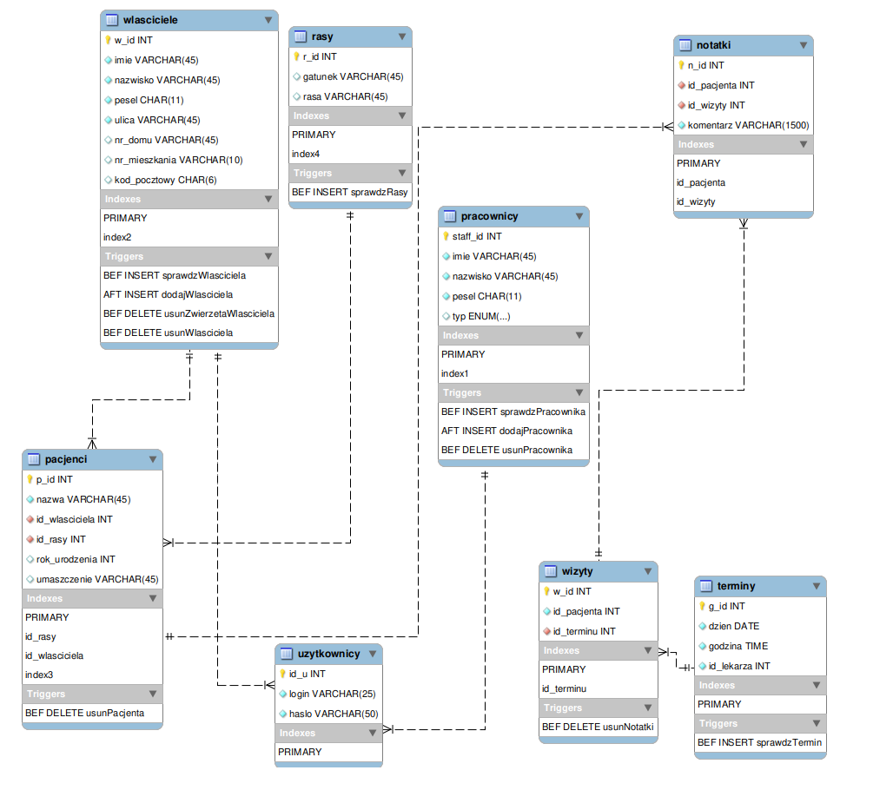

Do aplikacji nalezy zalogować się unikanlym loginem i hasłem. Hasła są przechowywane zaszyfrowane funkcją jednokierunkową sha1.

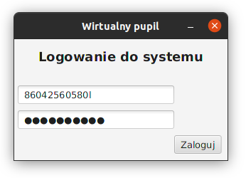

Panel główny różni się w zależności od typu użytkownika - właściciela, sekretariatu, lekarza i admina. 
Admin posiada dostęp do całej aplikacji, zatem zaprezentowany zostanie aplikacja z perspektywy admina.

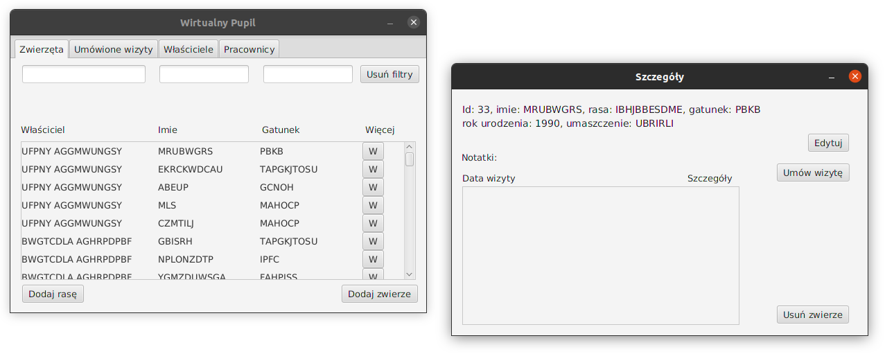

W aplikacji użytkownik może przeglądać zwierzęta, edytować ich dane, usuwać je, dodawać nowe, czy umawiać im wizyty.
Podobnie można dodawać nowe gatunki i rasy.

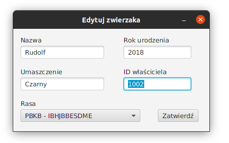

Interesujące nas pozycje w aplikacji możemy wyszukiwać za pomocą ciągu znaków.

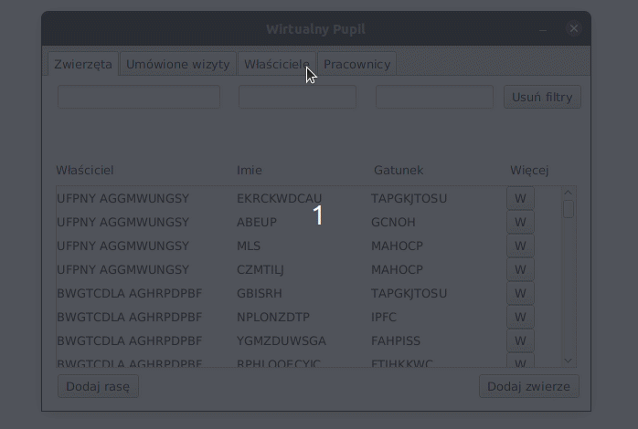

Istnieje możliwosć wyszukania terminu i umówiania wówczas wizyty. 

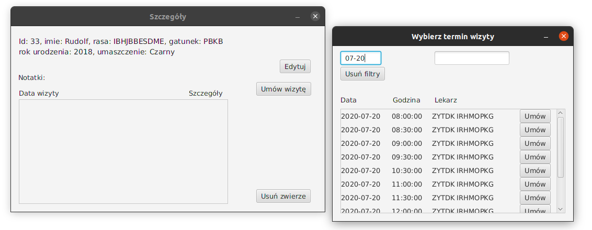

Lekarz do wizyty ma możliwość dopisania notatki.

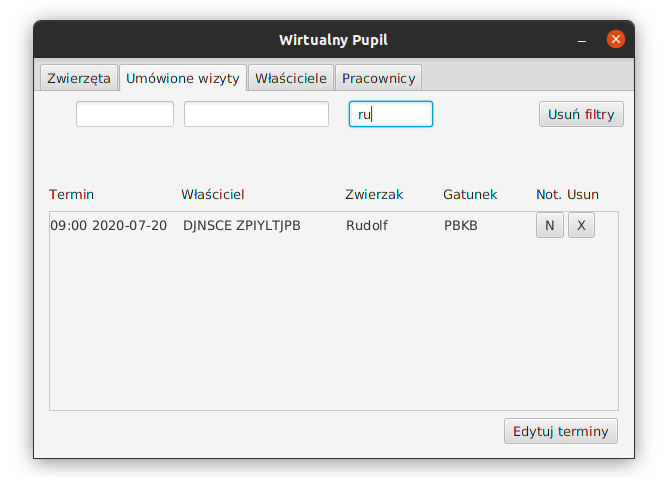

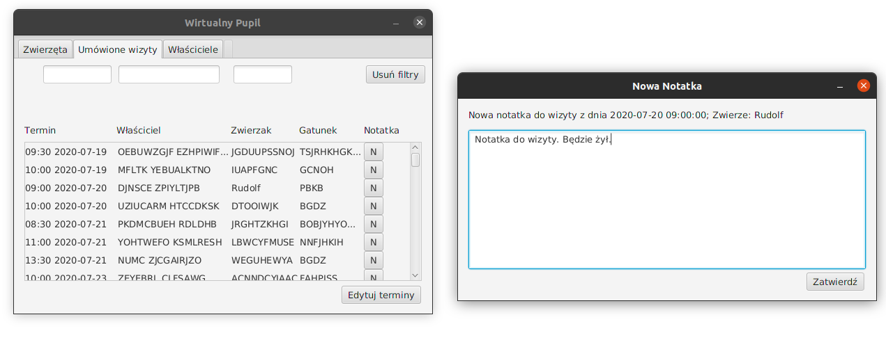

Notatka ta następnie pojawia się w szczegółach danego zwierzaka.

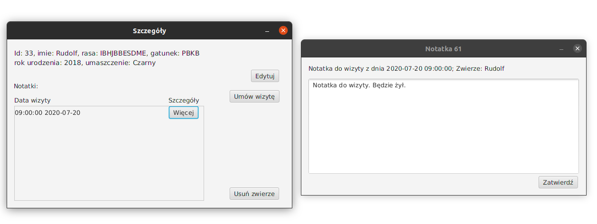

Z panelu wizyt można również dodać nowe terminy wizyt, z wyłączeniem tych już istniejących.

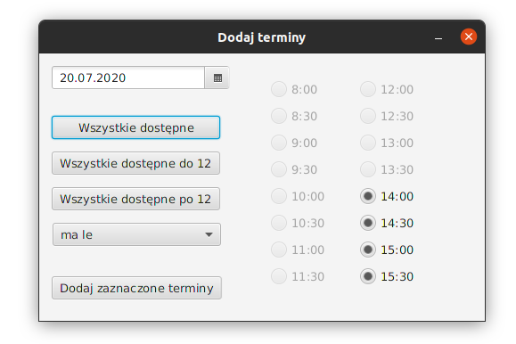

Z zakładki właściele można dodawać, edytować jak i usuwać właścicieli.

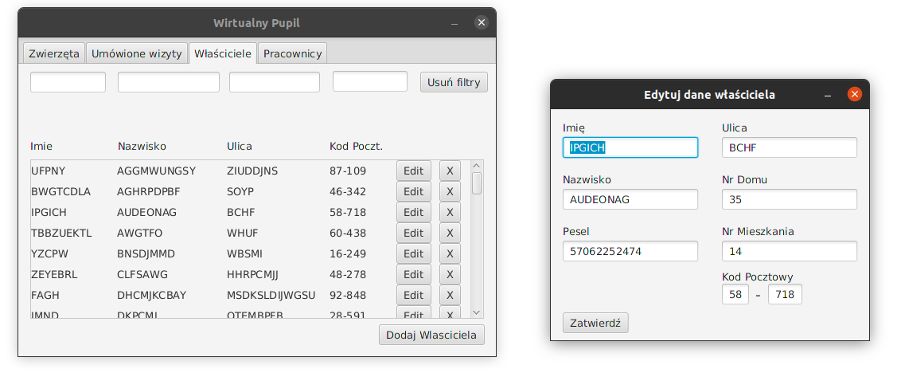

Podobnie dla pracowników, tutaj można również podać pełniony zawód. 
Z tej zakładki da się również wykonać backup i przywracanie zapisany stan bazy danych

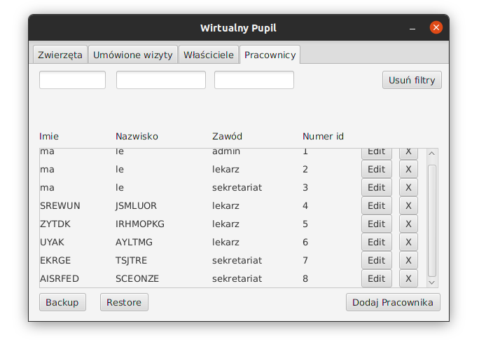

## MySQL
Do projektu został napisany skrypt w dialekcie MySQL generujący bazę danych, konieczne triggery dla zachowania jej spójności,
indexy poprawiające wydajność bazy, utworzeni potrzebni użytkownicy oraz napisana funkcja generująca przykładowe dane 
losowe potrzebne, w celu prezentacji apliakcji oraz debugowania.
